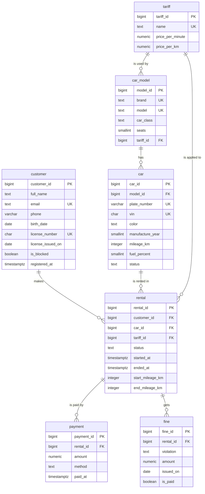

# Lab 1. Car Sharing Database

## Domain

A car sharing company rents cars by the minute. Every car belongs to a model, and every model
has a tariff with a price per minute and per kilometre. Customers register with a driver's
licence and can be blocked. A rental records who took which car, under which tariff, when it
started and ended and the mileage before and after. Customers pay for rentals, and traffic fines
received during a rental are attached to it.

## Tables

| Table | Meaning | Key |
| --- | --- | --- |
| `tariff` | price per minute and per kilometre | `tariff_id` |
| `car_model` | brand, model, class, seats and its tariff | `model_id` |
| `car` | a specific car: plate, VIN, mileage, fuel, status | `car_id` |
| `customer` | a registered driver | `customer_id` |
| `rental` | one rental of a car by a customer | `rental_id` |
| `payment` | a payment for a rental | `payment_id` |
| `fine` | a traffic fine received during a rental | `fine_id` |

| Relationship | Type | Foreign key |
| --- | --- | --- |
| tariff — car models | 1 : N | `car_model.tariff_id` |
| car model — cars | 1 : N | `car.model_id` |
| customer — rentals | 1 : N | `rental.customer_id` |
| car — rentals | 1 : N | `rental.car_id` |
| tariff — rentals | 1 : N | `rental.tariff_id` |
| rental — payments | 1 : N | `payment.rental_id` |
| rental — fines | 1 : N | `fine.rental_id` |

Customers and cars are in an M : N relationship through `rental`: a customer rents many cars and
a car is rented by many customers. `rental` is a full entity with its own key because the same
customer can take the same car many times.

## ER diagram

## Design decisions

- **Keys.** Every table has a surrogate `bigint GENERATED ALWAYS AS IDENTITY` key issued by
  PostgreSQL. Natural identifiers are protected with `UNIQUE`: tariff name, plate number, VIN,
  customer email, licence number and the pair (brand, model).
- **Types.**
  - Money and prices are `numeric`, because it is exact.
  - Dates are `date`, moments in time are `timestamptz`.
  - Small bounded numbers (seats, fuel, year) are `smallint`.
  - The VIN is `char(17)` and the licence number is `char(10)`, because their length is fixed.
- **Lists of values.** Car class, car status, rental status and payment method are `text` with
  `CHECK (... IN (...))`.
- **Model tariff.** The tariff is assigned to a model, not to a class: the Volkswagen Polo is an
  economy car but uses `Economy Plus`, so the class does not determine the tariff.
- **Rental tariff.** `rental` keeps its own `tariff_id` because the customer may choose a
  different tariff than the model's one, for example `Welcome Promo`.
- **Rental end.** A rental that is not `active` must have `ended_at`.
- **Car status.** It stores only `available`, `maintenance` and `decommissioned`. Whether a car is
  in use right now is visible from its active rental, so it is not stored twice.
- **ON DELETE rules.**
  - **RESTRICT** everywhere the history must be kept. A tariff, model, car or customer that is
    referenced cannot be deleted, and a rental with fines cannot be deleted because fines are
    legal documents.
  - **CASCADE** only for `payment.rental_id`. Payments are part of the rental and disappear with
    it.

## Normalization

- **1NF.** Every field holds one value, and there are no lists in a field: payments and fines
  are separate rows.
- **2NF.** Every table has a single-column key, so no attribute can depend on a part of the key.
- **3NF.** No non-key attribute depends on another non-key attribute:
  - brand, class, seats and tariff are stored in `car_model`, not repeated in every car. In
    `car` they would depend on `model_id` rather than on `car_id`;
  - `rental`, `payment` and `fine` store only ids of the customer, car and rental, not their
    names or plates;
  - `payment` and `fine` do not store the customer: it is known from the rental;
  - rental cost and duration are calculated from the times, mileage and tariff instead of being
    stored.
  - in `car_model` the tariff does not depend on the class: two economy models use different
    tariffs, so `model_id -> car_class -> tariff_id` is not a transitive dependency.

## Requirements coverage

| Requirement | Implementation |
| --- | --- |
| at least 5 meaningful tables | 7 tables |
| at least 2 `UNIQUE` | 6: `tariff_name_key`, `car_model_brand_model_key`, `car_plate_number_key`, `car_vin_key`, `customer_email_key`, `customer_license_number_key` |
| at least 3 `CHECK` | 18 |
| at least one composite constraint | `UNIQUE (brand, model)`, `CHECK (license_issued_on >= birth_date + interval '18 years')`, `CHECK (ended_at > started_at)`, `CHECK (end_mileage_km >= start_mileage_km)`, `CHECK (status = 'active' OR ended_at IS NOT NULL)` |
| `NOT NULL` for required attributes | every mandatory column |
| at least 5 rejected `INSERT` / `UPDATE` | 16 in [constraints_test.sql](../constraints_test.sql), plus 1 rejected `DELETE` |

## Constraint tests

| No. | Operation | Rejected by |
| --- | --- | --- |
| 1 | customer without a name | `NOT NULL` on `full_name` |
| 2 | customer with an existing email | `customer_email_key` |
| 3 | email without `@` | `customer_email_check` |
| 4 | licence issued before the age of 18 | `customer_license_age_check` |
| 5 | tariff with a zero price | `tariff_price_per_minute_check` |
| 6 | second Kia Rio model | `car_model_brand_model_key` |
| 7 | car with an existing plate number | `car_plate_number_key` |
| 8 | VIN of 15 characters | `car_vin_check` |
| 9 | fuel level of 120 % | `car_fuel_check` |
| 10 | unknown car status | `car_status_check` |
| 11 | rental that ends before it starts | `rental_period_check` |
| 12 | end mileage lower than start mileage | `rental_mileage_check` |
| 13 | rental completed without an end time | `rental_end_check` |
| 14 | rental of a nonexistent car | `rental_car_fkey` |
| 15 | negative payment | `payment_amount_check` |
| 16 | unknown payment method | `payment_method_check` |
| 17 | deleting a customer with rentals | `rental_customer_fkey`, `RESTRICT` |

The exact PostgreSQL messages are stored in [tests/constraints.out](../tests/constraints.out).
[tests/on_delete.sql](../tests/on_delete.sql) shows that deleting a rental deletes its payments
(`CASCADE`) and that the `RESTRICT` rules block the other deletions.

## Requirement change

The additional requirement is issued after the base model is accepted. It will be implemented in
`migration.sql` with `ALTER TABLE` on the populated database.
